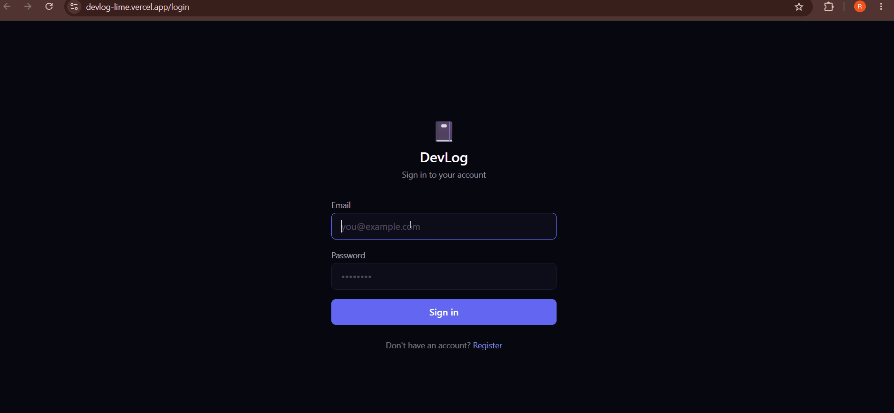

# 📓 DevLog

Track your daily coding sessions, set weekly goals, and get AI-generated weekly recaps of your progress.

**[🔴 Live Demo →](https://devlog-lime.vercel.app)**
**[⚡ API Docs →](https://devlog-production-36d6.up.railway.app/docs)**


---

## Screenshots



---

## Features

- **JWT Authentication** — secure register/login with bcrypt password hashing
- **Session Logging** — log language, hours, what you built, and your mood
- **Activity Heatmap** — custom SVG heatmap of your last 16 weeks
- **Weekly Goals** — set coding hour targets and track progress
- **AI Weekly Recap** — Gemini-powered summary of your week's sessions
- **Public Profiles** — shareable profile URL, viewable without login
- **Full Test Suite** — Pytest for backend, Vitest for frontend
- **CI/CD** — GitHub Actions runs tests on every push
- **Dockerized** — Docker Compose for local development

---

## Tech Stack

**Backend:** Python 3.12, FastAPI, PostgreSQL, SQLAlchemy, Alembic, JWT (python-jose), bcrypt/passlib, Pytest, Docker

**Frontend:** React 19, TypeScript, Vite, Tailwind CSS, TanStack Query, React Router, Recharts, Vitest

**AI:** Google Gemini API for weekly recap generation

**Infrastructure:** Docker Compose (dev), Railway (backend), Vercel (frontend), GitHub Actions (CI)

---

## Local Development

### Prerequisites

- Python 3.12
- Node.js 18+
- Docker Desktop

### Setup

```bash
git clone https://github.com/Raghavtripathii/devlog
cd devlog
```

**Start the database:**

```bash
docker-compose up -d
```

**Backend:**

```bash
cd backend
python -m venv venv
venv\Scripts\Activate    # Windows
pip install -r requirements.txt
cp .env.example .env     # fill in your values
alembic upgrade head
python -m uvicorn app.main:app --reload
```

**Frontend:**

```bash
cd frontend
npm install
npm run dev
```

Open http://localhost:5173

---

## Running Tests

**Backend:**

```bash
cd backend && pytest tests/ -v
```

**Frontend:**

```bash
cd frontend && npx vitest run
```

---

## CI/CD

GitHub Actions runs on every push to `main` and every pull request into it:

- **Backend job** — installs dependencies and runs Pytest against a SQLite database (no Docker needed in CI)
- **Frontend job** — installs dependencies and runs the Vitest suite

---

## Technical Decisions

**Why FastAPI?**
FastAPI generates OpenAPI docs automatically at `/docs` with zero extra work. Every endpoint is documented and testable without writing a single line of docs code. Pydantic v2 validation also catches bad request bodies before they reach the route logic.

**Why SQLite for tests, PostgreSQL for development?**
Tests run against SQLite so CI doesn't need Docker or a live database. The same SQLAlchemy ORM interface means the same query logic is being tested either way. Each test gets a fresh database that's torn down after, giving full test isolation.

**Why TanStack Query?**
It handles caching, background refetching, loading/error states, and cache invalidation. `queryClient.invalidateQueries(["sessions"])` after posting a session is one line that would take 30 lines of `useEffect` boilerplate — and it avoids the race conditions that come with hand-rolled fetching.

**Why JWT in the Authorization header instead of cookies?**
The API is consumed by a separate frontend domain. Cookies would need CORS credential and SameSite handling; Authorization headers work across domains by default and are a more natural fit for a REST API that might later serve a mobile client too.

**Why a custom SVG heatmap instead of a charting library?**
A library adds 50KB+ for something that's essentially a 2D array of colored rectangles. The custom implementation is a fraction of that size, renders faster, and gives full control over the color ramp and tooltip behavior.

---

## Project Structure

```
devlog/
├── backend/
│   ├── app/
│   │   ├── models/       # SQLAlchemy models (user, session, goal)
│   │   ├── routers/      # API routes (auth, sessions, goals, profile)
│   │   ├── schemas/      # Pydantic request/response schemas
│   │   ├── services/     # auth, AI recap, dependencies
│   │   └── main.py
│   ├── tests/            # Pytest suite
│   ├── alembic/          # DB migrations
│   └── Dockerfile
├── frontend/
│   └── src/
│       ├── pages/        # Login, Register, Dashboard, PublicProfile
│       ├── components/   # Heatmap, SessionForm, GoalCard, etc.
│       ├── context/      # AuthContext
│       ├── lib/          # API client
│       └── types/        # Shared TypeScript types
└── .github/workflows/    # CI pipeline
```

---

## Author

**Raghvendra Tripathi**
GitHub: [@Raghavtripathii](https://github.com/Raghavtripathii)